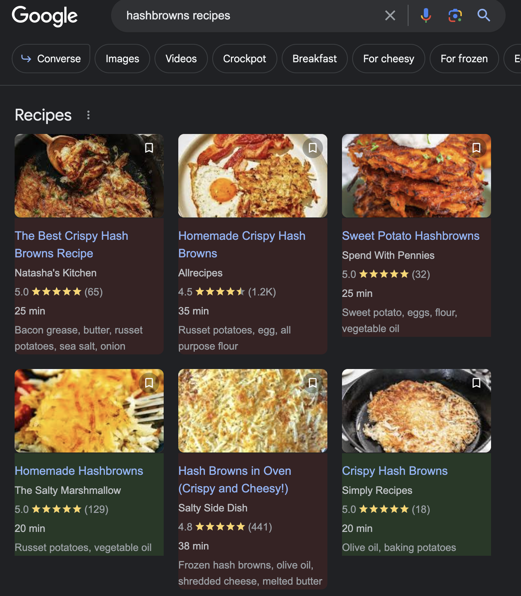

# Google Recipe VeggiFinder

## Overview

This Chrome extension helps users identify vegan and non-vegan recipes directly on Google's recipe search page. When a user searches for recipes on Google, the extension highlights vegan recipes in green and non-vegan recipes in red, for an at-a-glance understanding of which recipes align with vegan dietary restrictions. Importantly, this extension collects no data from the user, ensuring privacy.

  

---

## Table of Contents

1. [Getting Started](#getting-started)
2. [Prerequisites](#prerequisites)
3. [Installation](#installation)
4. [Usage](#usage)
5. [Technologies](#technologies)
6. [Contributing](#contributing)
7. [License](#license)

---

## Getting Started

To get a local copy up and running, follow these simple steps.

### Clone the Repository

You can clone the repository by running the following command in your terminal:

```bash
git clone https://github.com/MarkCarsonDev/google-recipe-veggifinder.git
```

### Prerequisites (only needed to edit functionality)
Before you begin, ensure you have the following npm packages installed:

is-vegan
```bash
npm install is-vegan
```

jquery
```bash
npm install jquery
```

browserify
```bash
npm install browserify
```

### Installation (only needed to edit functionality)
After cloning the repo and installing the prerequisites, you'll need to bundle the JavaScript file for use in the browser.

Bundle with Browserify
Run the following command in your terminal:

```bash
browserify veggifyer.js -o bundle.js
```

## Usage
1. Open Chrome and navigate to chrome://extensions/.
2. Enable Developer mode.
3. Click "Load Unpacked" and select the directory where you cloned the repository.
Once the extension is loaded, you can search for recipes on Google. The vegan recipes will be highlighted in green and non-vegan recipes in red.

## Technologies
- JavaScript
- jQuery
- [is-vegan npm package](https://github.com/hmontazeri/is-vegan/tree/master)


## Contributing
Pull requests are welcome. For major changes, please open an issue first to discuss what you would like to change.

## License
This project is licensed under the Unilicense - see the LICENSE.md file for details.